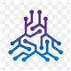
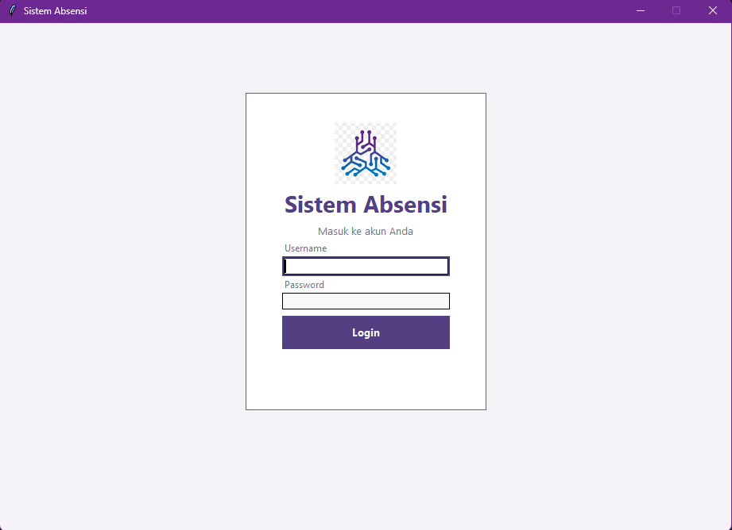
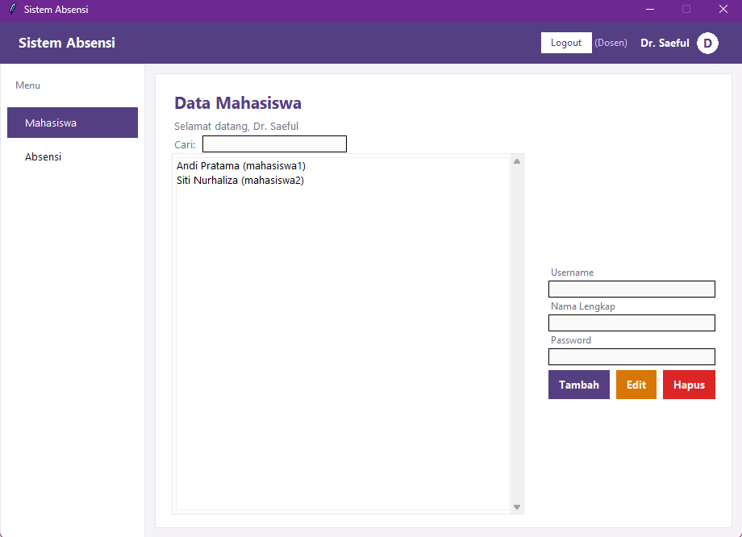
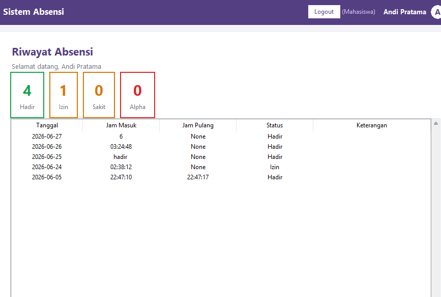

<div align="center">
  
  <br><br>
  <h1>Aplikasi Absensi</h1>
  <p>
    <sup><i>built with</i></sup>
    <br>
    <code>Python 3.14</code> <code>Tkinter</code> <code>SQLite3</code> <code>MVC</code>
  </p>
  <br>
  <table>
    <tr>
      <td><b>Ahmad Azarruddin</b></td>
      <td><kbd>23260028</kbd></td>
    </tr>
  </table>
</div>

<br>

---

## <sup>01</sup> &nbsp; Latar Belakang

Aplikasi desktop untuk mengelola absensi mahasiswa dengan antarmuka GUI modern. Menggunakan arsitektur **Model-View-Controller** dengan pemisahan logic, data, dan tampilan secara ketat. Database **SQLite** terintegrasi tanpa perlu konfigurasi tambahan.

---

## <sup>02</sup> &nbsp; Fitur Unggulan

<blockquote>
  &nbsp; Login autentikasi dengan dua role — Dosen dan Mahasiswa
  <br>
  &nbsp; Dashboard berbeda sesuai peran pengguna
  <br>
  &nbsp; CRUD data mahasiswa dengan validasi input
  <br>
  &nbsp; Absensi harian dengan opsi Hadir, Izin, Sakit, Alpha
  <br>
  &nbsp; Rekap absensi otomatis dengan visualisasi angka
  <br>
  &nbsp; Pencarian data secara real-time
  <br>
  &nbsp; Bulk action — isi semua status dalam satu klik
  <br>
  &nbsp; Toast notification tanpa messagebox konvensional
</blockquote>

---

## <sup>03</sup> &nbsp; Cara Menjalankan

```bash
# Masuk ke direktori proyek
cd "PROJECT 2"

# Jalankan aplikasi
python main.py
```

> **Catatan:** Tidak memerlukan instalasi paket tambahan. Semua library adalah bawaan Python.

---

## <sup>04</sup> &nbsp; Akun Default

| Role | Username | Password |
|------|----------|----------|
| `Dosen` | <kbd>dosen1</kbd> | <kbd>123456</kbd> |
| `Mahasiswa` | <kbd>mahasiswa1</kbd> | <kbd>123456</kbd> |
| `Mahasiswa` | <kbd>mahasiswa2</kbd> | <kbd>123456</kbd> |

---

## <sup>05</sup> &nbsp; Tampilan Aplikasi

<div align="center">

| **Login** | **Dashboard Dosen** | **Mahasiswa** |
|:---------:|:-------------------:|:-------------:|
|  |  |  |

</div>

---

## <sup>06</sup> &nbsp; Struktur Proyek

```
PROJECT 2/
├── main.py                 # Entry point
├── controller/             # Business logic
│   ├── login_controller.py
│   ├── dosen_controller.py
│   └── mahasiswa_controller.py
├── model/                  # Database layer
│   ├── user_model.py
│   └── absensi_model.py
├── view/                   # User interface
│   ├── login_view.py
│   ├── dosen_view.py
│   └── mahasiswa_view.py
└── assets/
    └── logo.png
```

---

## <sup>07</sup> &nbsp; Spesifikasi Teknis

| Komponen | Detail |
|----------|--------|
| **Bahasa** | Python 3.14 |
| **GUI Framework** | Tkinter (native) |
| **Database** | SQLite3 (native) |
| **Arsitektur** | MVC Pattern |
| **Dependency** | Zero — 100% built-in |

---

<div align="center">
  <sub>&copy; 2026 &middot; Tugas Pemrograman Desktop</sub>
</div>
